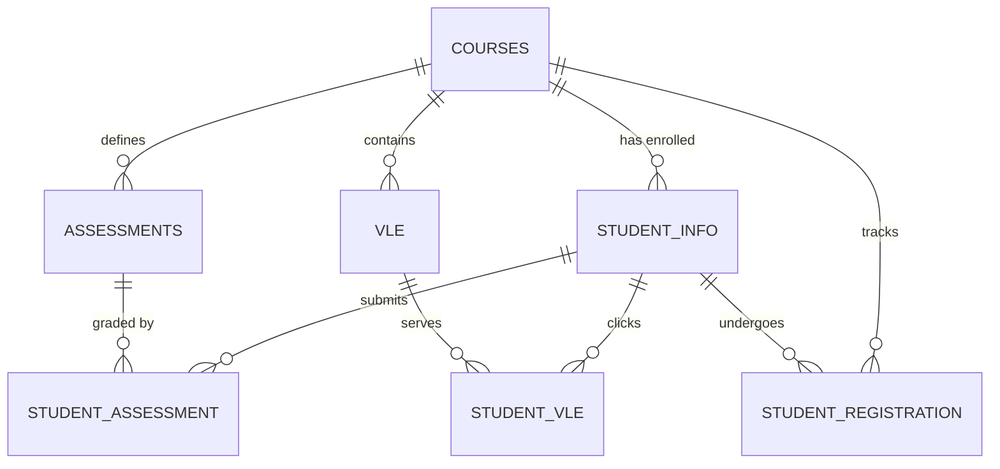

# Dataset Relationships and Schema Mapping

This document describes how the files/tables across our datasets relate to one another.

## 1. OULAD Schema Relationships (03_oulad)
The OULAD dataset is highly relational. Below is the mapping of how the 7 tables link together:

### Primary and Foreign Keys:
- **`courses.csv`**
  - *Primary Key*: `(code_module, code_presentation)`
- **`assessments.csv`**
  - *Primary Key*: `id_assessment`
  - *Foreign Key*: `(code_module, code_presentation)` -> references `courses(code_module, code_presentation)`
- **`vle.csv`**
  - *Primary Key*: `id_site`
  - *Foreign Key*: `(code_module, code_presentation)` -> references `courses(code_module, code_presentation)`
- **`studentInfo.csv`**
  - *Primary Key*: `(id_student, code_module, code_presentation)`
  - *Foreign Key*: `(code_module, code_presentation)` -> references `courses(code_module, code_presentation)`
- **`studentRegistration.csv`**
  - *Primary/Composite Key*: `(id_student, code_module, code_presentation)`
  - *Foreign Key*: `id_student` -> references `studentInfo(id_student)`
  - *Foreign Key*: `(code_module, code_presentation)` -> references `courses(code_module, code_presentation)`
- **`studentAssessment.csv`**
  - *Composite Key*: `(id_student, id_assessment)`
  - *Foreign Key*: `id_student` -> references `studentInfo(id_student)`
  - *Foreign Key*: `id_assessment` -> references `assessments(id_assessment)`
- **`studentVle.csv`**
  - *Composite Key*: `(id_student, id_site, date)`
  - *Foreign Key*: `id_student` -> references `studentInfo(id_student)`
  - *Foreign Key*: `id_site` -> references `vle(id_site)`
  - *Foreign Key*: `(code_module, code_presentation)` -> references `courses(code_module, code_presentation)`

### OULAD Schema Relationship Diagram:

---

## 2. UCI Student Performance Relationships (01_student_performance)
- **`student-mat.csv`** and **`student-por.csv`** share a subset of students who are enrolled in both Math and Portuguese classes.
- *Matching Key*: Students can be identified/matched across both files using the following attributes:
  `["school", "sex", "age", "address", "famsize", "Pstatus", "Medu", "Fedu", "Mjob", "Fjob", "reason", "nursery", "internet"]`
- *Relevance*: Merging them allows joint performance and behavior profiling (e.g., studying if performance in Math correlates with Portuguese).

---

## 3. Cross-Dataset Semantic Connections
There are no direct database-level keys (like shared ID columns) between the different dataset folders (`01`, `02`, `03`, `04`, `05`) because they represent different source systems, institutions, or synthetic generations. However, they share strong **semantic relationships** that can be utilized to train unified models or design sales intelligence features:

1. **Lead Generation to Enrollment Pipeline**:
   - `05_education_marketing` contains campaign lead numbers.
   - `02_student_dropout` contains student enrollment demographic records (which can represent converted leads).
   - *Mapping*: Marketing campaign channels (e.g., Search, Social) can be matched against `Application mode` in the student dropout dataset to understand which acquisition channels produce the highest-quality students.
2. **Student Engagement to Academic Outcome**:
   - `04_online_engagement` contains active engagement logs (login frequency, session duration).
   - `03_oulad/studentVle.csv` contains VLE clickstream logs.
   - *Mapping*: We can map engagement intensity (e.g., weekly logins, click counts) to final dropout status to train an engagement-based early warning system.
